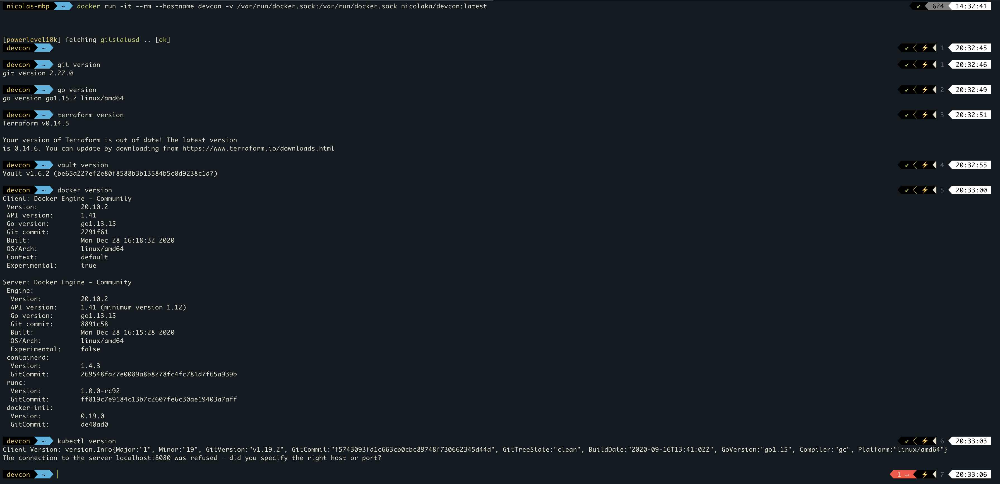

## DEVCON: a Complete Dev Environment in a Container 📦 

**Development Container Blog Post:** [link](https://medium.com/@nicolakabar/the-ultimate-development-environment-moving-from-vagrant-to-docker-for-mac-532bcf07e186)

As a rule of thumb, I never install any packages directly onto my Mac unless I absolutely have to. So I created this sample development container that I use with Docker for Mac to be my sole dev environment. There is a breakdown in the Dockerfile of which tools are installed. 


### Package Versions

ENV GOLANG_VERSION 1.20.3
ENV GOLANG_DOWNLOAD_SHA256 eb186529f13f901e7a2c4438a05c2cd90d74706aaa0a888469b2a4a617b6ee54
ENV TERRAFORM_VERSION 1.5.2
ENV VAULT_VERSION 1.14.0
ENV CONSUL_VERSION 1.16.0
ENV PACKER_VERSION 1.9.2
ENV BOUNDARY_VERSION 0.13.0
ENV WAYPOINT_VERSION 0.11.0
ENV HCDIAG_VERSION 0.5.1
ENV HCDIAG_EXT_VERSION 0.5.0
ENV KUBECTL_VER 1.27.1
ENV HELM_VERSION 3.12.0
ENV CALICO_VERSION 3.16.1
ENV COSIGN_VERSION 1.8.0
ENV INFRACOST_VERSION 0.10.28

### Usage

```
$ docker run -it --rm --hostname devcon -v /var/run/docker.sock:/var/run/docker.sock nicolaka/devcon:latest
```



Optionally, you can mount your local Mac dev directory inside the container by adding `-v /path/to/dir:/root`. Typically, I mount a specific dev directory from my Mac that contains my dot files (including  git, ssh config + keys) to make it easier to use across both Mac and within the dev container. This way I can make sure that the dev container is a throw-away, leaving no keys/secrets exposed or written in it. 

Feel free to use and adjust to fit your own dev tooling!

Cheers 🍺
 

